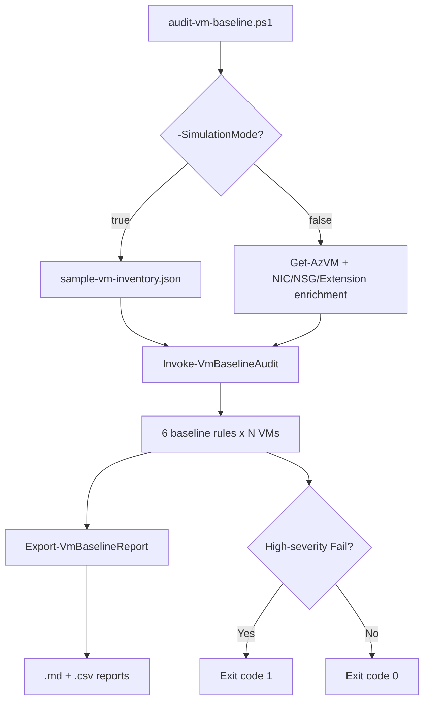

# Azure VM Baseline and Compliance Toolkit

[](https://github.com/example/project-b-vm-baseline-compliance/actions/workflows/powershell-ci.yml)


A PowerShell toolkit that audits Azure VMs against a security/operations baseline —
tagging, network security group (NSG) association, backup posture, monitoring
posture, disk settings, and identity settings — and produces a professional
Markdown/CSV compliance report with remediation guidance. Fully runnable offline via
`-SimulationMode` with **zero Azure cost or credentials**.

## Business problem

Enterprises need repeatable, auditable proof that VMs meet a security/operations
baseline. Manually eyeballing the Azure Portal doesn't scale past a handful of VMs,
and ad-hoc scripts rarely produce artifacts a security or compliance review can
actually consume. This toolkit turns "is this VM compliant?" into a structured,
versioned, testable rule engine that produces the same report every time — the
foundation of governance-as-code.

## Architecture overview

`Get-VmBaselineTarget` resolves target VM objects (from live Azure or simulation
data) into one consistent shape. Six independent rule functions each evaluate one
baseline rule against one VM. `Invoke-VmBaselineAudit` orchestrates all rules against
all VMs, and `Export-VmBaselineReport` renders the results to Markdown/CSV. See
[docs/architecture.md](docs/architecture.md) for the full breakdown and diagram below.



## Prerequisites

- PowerShell 7.0 or later (`pwsh`).
- [Pester](https://pester.dev/) 5.0+ (only needed to run the test suite).
- **Simulation mode:** nothing else. No Azure account, subscription, or credentials required.
- **Live mode only:** the [Az PowerShell module](https://learn.microsoft.com/powershell/azure/), an authenticated session (`Connect-AzAccount`), and at least **Reader** role on the target subscription/resource group.

## Baseline rules

Full details, check logic, and remediation guidance for every rule live in
[docs/baseline-rules.md](docs/baseline-rules.md). Summary:

| Rule | Severity |
|---|---|
| Tagging (`Environment`, `Owner`, `CostCenter`, `Application`) | Medium |
| NSG Association | High |
| Backup Posture | High |
| Monitoring Posture | Medium |
| Disk Settings (SKU + encryption at host) | Medium |
| Identity Settings (Managed Identity) | High |

## Things you must edit before running (live mode only)

Simulation mode requires no edits at all. For live mode, replace these placeholders:

- `-SubscriptionId` — your real Azure subscription ID (no default is provided intentionally).
- `-ResourceGroupName` — the resource group to scope the audit to.
- `config/baseline.config.psd1` — adjust `RequiredTags`, `AllowedOsDiskSkus`, `AllowedIdentityTypes`, etc. to match your organization's actual policy (the shipped values are a reasonable default, not a mandate).

## Example commands

### Simulation mode (recommended default — $0 cost, no credentials)

```powershell
# Audit all 5 sample VMs; exits 1 because one VM intentionally fails High-severity rules
pwsh ./scripts/audit-vm-baseline.ps1

# Audit a single VM from the sample data
pwsh ./scripts/audit-vm-baseline.ps1 -VMName 'vm-web01-prod'

# Preview safe tag remediation with zero risk
pwsh ./scripts/remediate-vm-baseline.ps1 -SimulationMode -WhatIf
```

### Live mode

```powershell
Connect-AzAccount

pwsh ./scripts/audit-vm-baseline.ps1 -SimulationMode:$false `
    -SubscriptionId '00000000-0000-0000-0000-000000000000' `
    -ResourceGroupName 'rg-contoso-prod-web'

pwsh ./scripts/remediate-vm-baseline.ps1 `
    -SubscriptionId '00000000-0000-0000-0000-000000000000' `
    -ResourceGroupName 'rg-contoso-prod-web' -WhatIf
```

## Validation workflow

```powershell
Install-Module -Name Pester -MinimumVersion 5.0.0 -Scope CurrentUser -Force
Invoke-Pester -Path ./tests -Output Detailed
```

See [docs/validation-checklist.md](docs/validation-checklist.md) for the full
end-to-end validation checklist (module import, PSScriptAnalyzer, simulation runs,
test suite, CI).

## Cleanup workflow (optional live test VM)

If you used `scripts/deploy-test-vm.ps1` to stand up the optional
`vm-baseline-test01` demo VM, tear it down when finished:

```powershell
pwsh ./scripts/cleanup-test-vm.ps1 -SubscriptionId '<subId>' -ResourceGroupName 'rg-baseline-demo' -WhatIf
pwsh ./scripts/cleanup-test-vm.ps1 -SubscriptionId '<subId>' -ResourceGroupName 'rg-baseline-demo' -Confirm
```

## Cost notes

- **Simulation mode is $0**, always. It reads `sample-data/sample-vm-inventory.json` and never calls Azure.
- The optional `scripts/deploy-test-vm.ps1` demo VM uses `Standard_B1s` (small, often
  within free-tier eligible hours), has no public IP, uses an IP-restricted NSG, and
  is tagged with an auto-shutdown schedule — mirroring the same cost-safety patterns
  used in the companion home-lab reference build. It is entirely optional; nothing in
  this toolkit requires it.
- Always run `cleanup-test-vm.ps1` after a live demo to avoid ongoing charges.

## Security notes

- **Auditing** (`audit-vm-baseline.ps1`) only ever *reads* resources — the **Reader**
  built-in role is sufficient in live mode. It never mutates anything.
- **Remediating** (`remediate-vm-baseline.ps1`) requires elevated permissions
  (**Tag Contributor** at minimum for the default tag remediation; **Virtual Machine
  Contributor** for `-IncludeIdentityRemediation`). It defaults to `-WhatIf`-safe,
  additive-only tag changes and requires explicit opt-in switches
  (`-IncludeIdentityRemediation`, `-Force`) for anything else — see
  [docs/baseline-rules.md](docs/baseline-rules.md) for exactly which rules are
  safely automatable.
- No credentials, connection strings, or secrets are ever embedded in any script —
  the Identity Settings rule exists specifically to discourage that pattern on the
  VMs being audited.

## Troubleshooting

See [docs/troubleshooting.md](docs/troubleshooting.md) for common issues (module
import path problems, missing Az module, unexpected exit codes, PSScriptAnalyzer
warnings, and more).

## How to demo this project

**You can run this entire project offline, in an interview, with no live Azure
subscription, no credentials, and no cost.** `-SimulationMode` is the default and
uses the exact same rule-engine code as live mode — it just sources VM data from
`sample-data/sample-vm-inventory.json` instead of `Get-AzVM`. See
[docs/demo-guide.md](docs/demo-guide.md) for a full walkthrough script, including
what to say when asked why simulation mode exists.

```powershell
pwsh ./scripts/audit-vm-baseline.ps1        # zero-cost, zero-credential demo
```

## What this proves to an employer

Governance/compliance-as-code thinking, reporting discipline, safe/tiered
remediation patterns, and genuine test coverage on infrastructure tooling. Full
write-up in [docs/employer-value.md](docs/employer-value.md).

## Skills demonstrated

- PowerShell module design (public/private separation, manifest-driven exports, comment-based help)
- Azure Resource Manager object model fluency (VM, NIC, NSG, managed identity, Recovery Services vault)
- Rule-engine / policy-as-code architecture with externalized configuration
- Pester v5 test authoring (compliant/non-compliant fixtures, exit-code pinning)
- GitHub Actions CI (PSScriptAnalyzer gating, NUnit artifact upload, offline smoke testing)
- Technical writing (Mermaid diagrams, rule tables, runbook-style guides)
- Security-conscious automation design (least privilege, `-WhatIf` defaults, tiered remediation risk)

## Future enhancements

- Export findings directly as an Azure Policy initiative definition for native enforcement.
- Multi-subscription / management-group-scoped scanning with a consolidated report.
- HTML report output (in addition to Markdown/CSV) for dashboard embedding.
- Push results into Log Analytics / Azure Monitor for trend tracking over time.
- Add a size-compliance rule using the existing `AllowedVmSizes` config value.

## Suggested repo description

> Audits Azure VMs against a tagging/NSG/backup/monitoring/disk/identity security
> baseline and produces Markdown/CSV compliance reports — fully demoable offline via
> a zero-cost simulation mode.

## Suggested repo topics

`azure`, `powershell`, `compliance`, `security-baseline`, `governance`, `pester`, `devops`, `cloud-security`, `az-104`, `reporting`

## Recruiter-friendly summary

This project is a PowerShell-based compliance auditing tool for Azure virtual
machines. It checks VMs against six real-world security/governance rules (tagging,
network security, backup, monitoring, disk encryption, and identity), producing
professional reports a security or audit team could actually use — and it includes
its own automated test suite and CI pipeline. Crucially, it can be fully demonstrated
without needing access to a live Azure subscription, which makes it easy to walk
through in an interview setting.

## License

[MIT](LICENSE)
