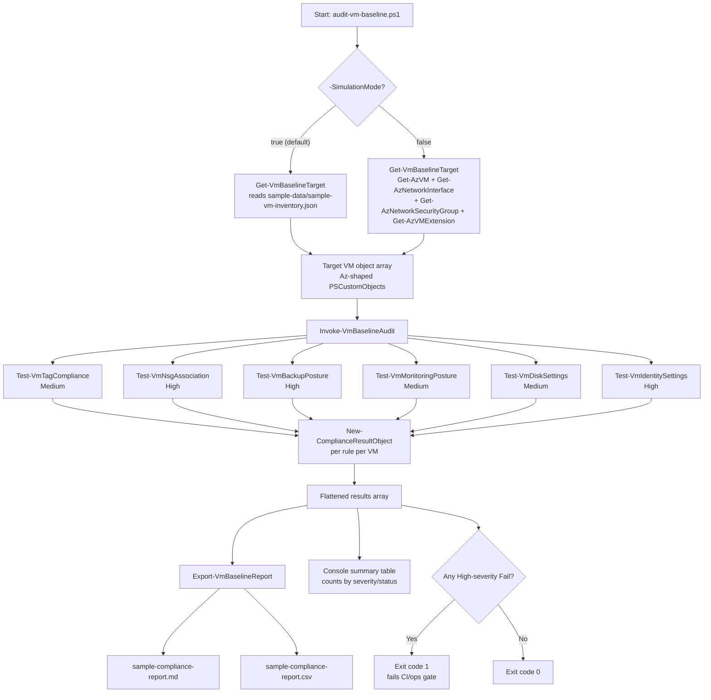

# Architecture

## Overview

The VM Baseline and Compliance Toolkit is intentionally simple: a PowerShell module
(`VmBaselineToolkit`) implements six independent, pure-function baseline rules, an
orchestrator that runs those rules against a set of target VM objects, and a report
exporter that renders the results into Markdown/CSV. A thin CLI script
(`scripts/audit-vm-baseline.ps1`) wires those pieces together and adds console
output, exit-code logic, and a `-SimulationMode` data source so the same code path
works identically whether the VM data came from live Azure or from
`sample-data/sample-vm-inventory.json`.

This separation is what makes the toolkit fully demonstrable offline: every rule
function operates on a plain `PSCustomObject` describing a VM, so it does not matter
whether that object was built from `Get-AzVM` + `Get-AzNetworkInterface` +
`Get-AzVMExtension`, or read straight out of a JSON fixture.

## Audit flow

## Component responsibilities

| Component | Responsibility |
|---|---|
| `Get-VmBaselineTarget` | Resolves the array of target VM objects, from either simulation JSON or live Az cmdlets, into one consistent shape. |
| `Test-Vm*` rule functions (x6) | Each evaluates ONE baseline rule against ONE VM object and returns a `New-ComplianceResultObject`-shaped result. Pure functions — no side effects, easy to unit test. |
| `Invoke-VmBaselineAudit` | Orchestrator: resolves targets, loads config, runs all six rules against every target VM, returns the flattened result array. |
| `Export-VmBaselineReport` | Renders a result array into Markdown and/or CSV report files. Supports `-WhatIf`. |
| `Get-VmRemediationGuidance` | Central lookup of remediation guidance/automatability metadata by rule name, used by docs and `remediate-vm-baseline.ps1`. |
| `scripts/audit-vm-baseline.ps1` | CLI entry point: wires the above together, prints a console summary, sets the process exit code. |
| `scripts/remediate-vm-baseline.ps1` | Safely remediates only the Tagging rule by default; Identity remediation is opt-in; everything else is report-only. |
| `scripts/deploy-test-vm.ps1` / `cleanup-test-vm.ps1` | Optional, cost-aware live demo VM lifecycle (not required to demo the toolkit). |
| `config/baseline.config.psd1` | Single source of truth for rule thresholds/required tags/allowed SKUs, so policy changes don't require code changes. |

## Why this design is testable

Because every rule function takes a VM object and returns a plain result object with
no hidden Azure calls, Pester can mock at the boundary (`Get-VmBaselineTarget`) rather
than needing to mock deep inside each rule — see `tests/VmBaselineToolkit.Module.Tests.ps1`.
